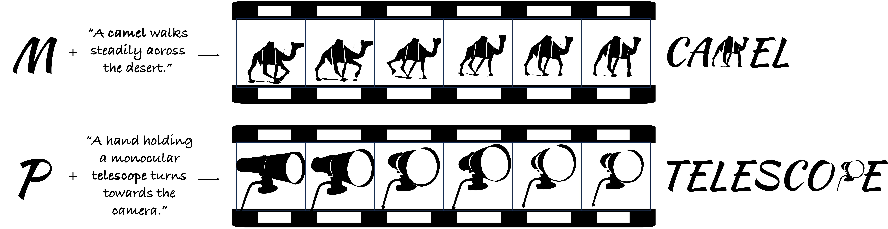

# Dynamic Typography: Bringing Words to Life
<a href="https://animate-your-text.github.io/demo/"></a>
<a href="https://arxiv.org/abs/2311.13608"></a>
<a href="https://www.apache.org/licenses/LICENSE-2.0.txt"></a>

<br>
<p align="center">
  

> <a href="https://animate-your-text.github.io/demo/">**Dynamic Typography: Bringing Words to Life**</a>
>
<a href="https://zliucz.github.io/">Zichen Liu*</a>,
<a href="https://yihao-meng.github.io/">Yihao Meng*</a>,
<a href="https://ken-ouyang.github.io/">Hao Ouyang</a>,
<a href="https://bruceyyu.github.io/">Yue Yu</a>,
<a href="https://www.linkedin.com/in/bolin-zhao-38664b266/">Bolin Zhao</a>,
<a href="https://danielcohenor.com/">Daniel Cohen-Or</a>,
<a href="http://www.huamin.org/index.htm">Huamin Qu</a>
> \* Denotes equal contribution  
> <br>
>  We present an automated text animation scheme, termed "Dynamic Typography," which combines two challenging tasks. It deforms letters to convey semantic meaning and infuses them with vibrant movements based on user prompts.
</p>

# Setup
```
git clone https://github.com/zliucz/animate-your-word.git
cd animate-your-word
```

## Environment
To set up our environment, please run:
```
conda env create -f environment.yml
```
Next, you need to install diffvg:
```bash
git clone https://github.com/BachiLi/diffvg.git
cd diffvg
git submodule update --init --recursive
python setup.py install
```

## Generate Your Animation!
To animate a letter within a word, run the following command:
```
CUDA_VISIBLE_DEVICES=0 python dynamicTypography.py \
        --word "<The Word>" \
        --optimized_letter "<The letter to be animated>" \
        --caption "<The prompt that describes the animation>" \
        --use_xformer --canonical --anneal \
        --use_perceptual_loss --use_conformal_loss  \
        --use_transition_loss
```
For example:
```
CUDA_VISIBLE_DEVICES=0 python dynamicTypography.py \
        --word "father" --optimized_letter "h" \
        --caption "A tall father walks along the road, holding his little son with his hand" \
        --use_xformer --canonical --anneal \
        --use_perceptual_loss --use_conformal_loss \
        --use_transition_loss
```
or
```
CUDA_VISIBLE_DEVICES=0 python dynamicTypography.py \
        --word "PASSION" --optimized_letter "N" \
        --caption "Two people kiss each other, one holding the others chin with his hand" \
        --use_xformer --canonical --anneal \
        --use_perceptual_loss --use_conformal_loss  \
        --use_transition_loss --schedule_rate 5.0
```


The output animation will be saved to "videos". <br>
The output includes the network's weights, SVG frame logs and their rendered .mp4 files (under svg_logs and mp4_logs respectively). <br>
We save both the in-context and the sole letter animation. <br>
At the end of training, we output a high quality gif render of the last iteration (HG_gif.gif). <br>

We provide many example run scripts in `scripts`, the expected resulting gifs are in `example_gifs`. More results can be found on our [project page](https://animate-your-text.github.io/demo/).

## Tips:

If your animation remain the same with the original letter's shape or deviate too much from the original letter shape, please set a lower/higher `--perceptual_weight`.

If your want the animation too be less/more geometrically similar to the original letter, please set a lower/higher `--angles_w`.

If you want to further enforce appearance consistency between frames, please set a higher `--transition_weight`. But please note that this will reduce the motion amplitude.

Small visual artifacts can often be fixed by changing the `--seed`.

## Acknowledgment:
Our implementation is based on [word-as-image](https://github.com/Shiriluz/Word-As-Image) and [live-sketch](https://github.com/yael-vinker/live_sketch). Thanks for their remarkable contribution and released code.
